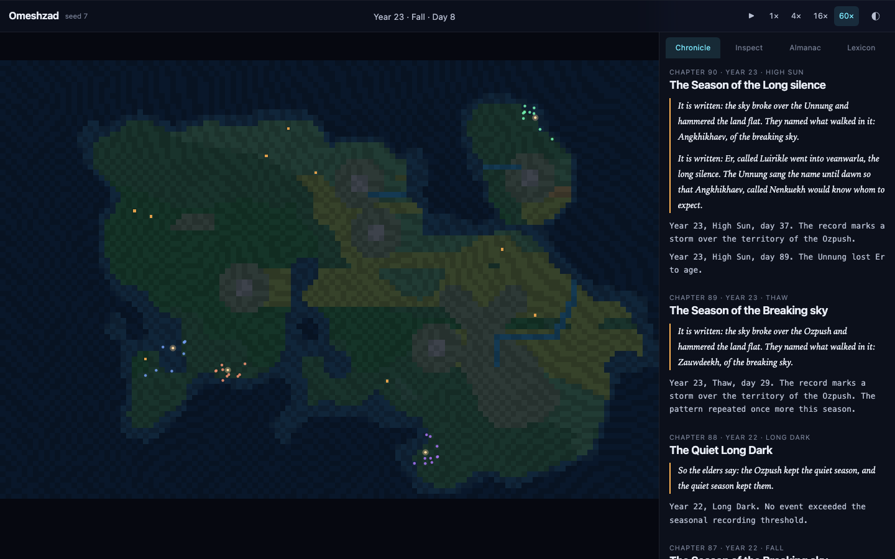
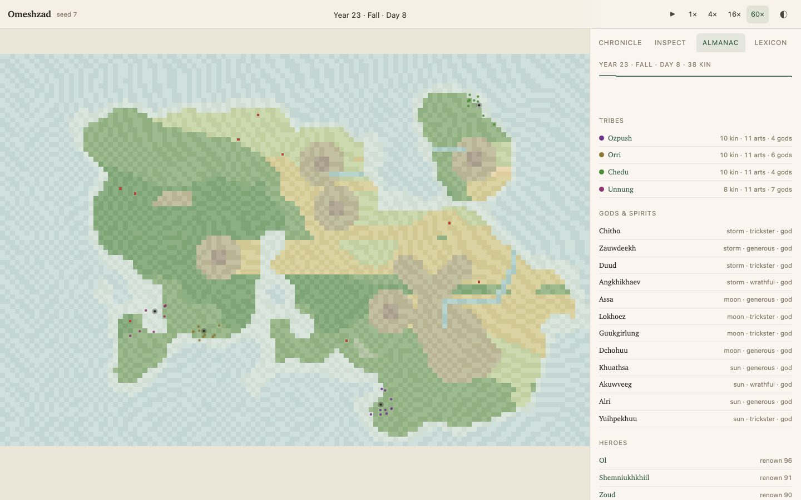
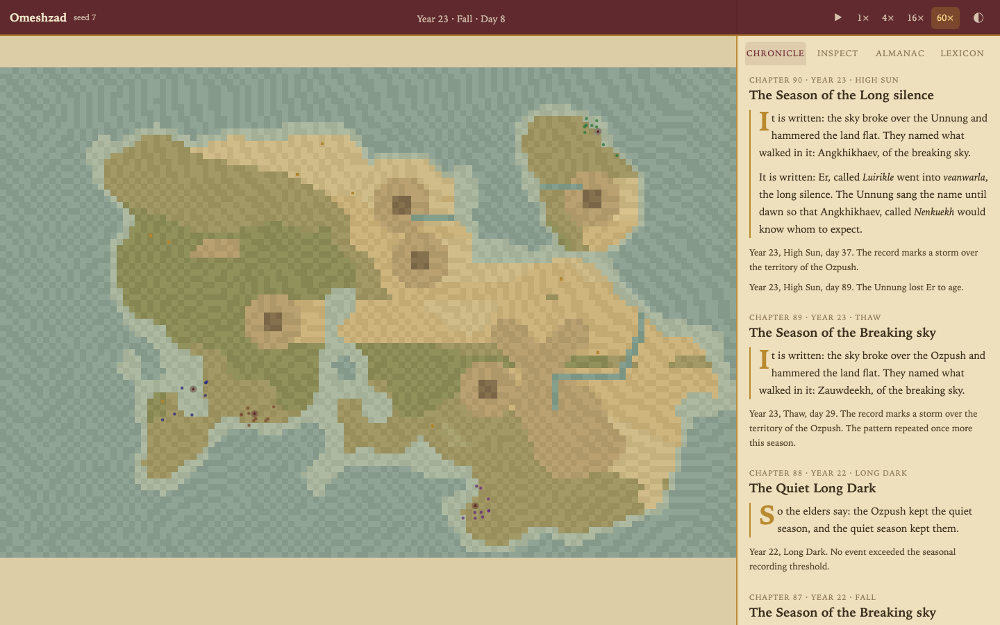

# MICROCOSM — a pocket universe that writes its own mythology

> Seed a world. Watch tribes form, coin words, survive famines, invent gods —
> and read the chronicle their civilization writes about itself.

MICROCOSM is a **deterministic artificial world** that runs entirely in your browser.
No backend, no API keys, no accounts. From a single seed number it generates terrain,
climate, creatures ("kin") with genomes and memories, tribes with distinct cultures and
**emergent proto-languages**, discoveries, wars, plagues, eclipses — and, on top of the
raw event stream, a **Chronicler** that turns what actually happened into two parallel
histories:

- **The Observer's Log** — the cold, scientific record of events.
- **The Myth** — the same events retold in the voice of the world's own people, using
  *their* words, *their* gods, *their* heroes.

The gap between those two texts — between what happened and what the world *believes*
happened — is the whole point of the project.

## Why this exists

Every event in the chronicle is real: traceable to simulation state, reproducible from
the seed. Nothing is faked by a language model. The mythology is *earned* — a tribe only
worships a sun-eater god if an eclipse actually darkened a famine. Same seed → same
world → same gods, every time.

## Quick start

```bash
npm install
npm run dev        # open the printed localhost URL
npm test           # deterministic engine tests
npm run build      # static build in dist/ (deployable to GitHub Pages)
```

Type a seed (or shuffle one), press **Begin**, and let time run. Speed up to 16×,
pause, click anything on the map to inspect it, and read the Chronicle as chapters
appear each season.

## The three designs

The entire interface ships in three complete visual designs — cycle them live with the
**theme button** (top right) or `T`:

| Observatory | Field Journal | Illuminated |
|---|---|---|
|  |  |  |

| Theme | Mood | Character |
|---|---|---|
| **Observatory** | dark, glassy, visionOS | You are a scientist watching a terrarium universe |
| **Field Journal** | light, paper & ink | You are a naturalist sketching what you find |
| **Illuminated** | parchment, gold & burgundy | You are a medieval monk copying the world's scripture |

See [docs/DESIGNS.md](docs/DESIGNS.md) for the full design language of each.

## Documentation map

| Doc | Contents |
|---|---|
| [docs/SIMULATION.md](docs/SIMULATION.md) | Full simulation spec: systems, tick order, formulas, language & myth models |
| [docs/DESIGNS.md](docs/DESIGNS.md) | The three visual designs and the shared interaction grammar |
| [memory/](memory/) | The project brain (Second Brain Protocol): state, decisions, log |
| [protocol/BOARD.md](protocol/BOARD.md) | Protocol OS board: workstreams and status |

## Architecture in one paragraph

A pure TypeScript simulation core (`src/sim/`) advances a `World` one tick (= one day)
at a time through a fixed pipeline of systems — climate, vegetation, agent needs & AI,
birth/death, tribes, language, discovery, conflict, religion — each drawing randomness
only from named, seeded PRNG streams so the whole universe is a pure function of its
seed. Systems emit typed `WorldEvent`s into an event log; each season the `Chronicler`
(`src/chronicle/`) scores events for salience and renders the top ones through template
grammars fed by each tribe's own phonology and lexicon. The UI layer (`src/ui/`,
vanilla TS + Canvas 2D) renders the map, inspector, almanac and chronicle, and never
mutates sim state directly. Three themes are pure CSS custom-property sets plus
per-theme canvas palettes.

## Status

Built end-to-end in one autonomous session (2026-07-10) by Claude (Fable 5) under the
Brain OS / Protocol OS regime. See [memory/LOG.md](memory/LOG.md) for the honest record.
